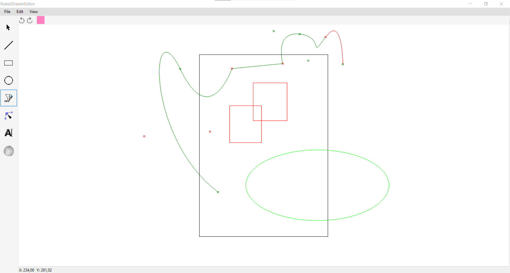
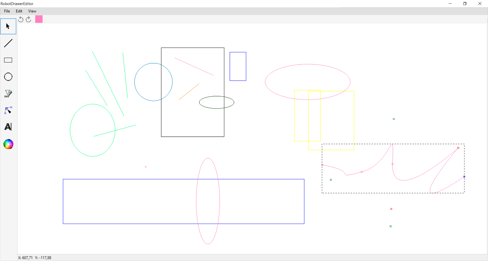
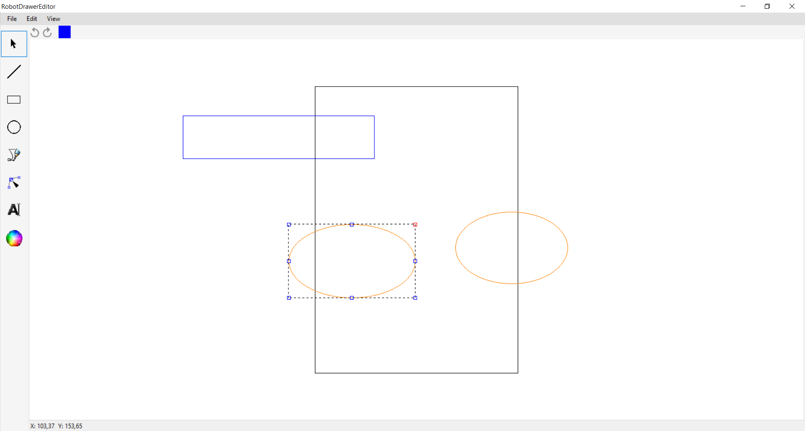

# RobotDrawerEditorCsharp
After the previous [failed try](https://github.com/TomasZilinek/RobotDrawerEditor_Cplusplus) in C++ I decided to actually program the vector graphics editor for my Arduino robot arm for drawing. This time it's actually a usable program which produces files. I haven't yet made the arm use outputs of this program.

You can edit multiple shapes in a vector graphics manner (line, rectangle, ellipse, bezier curve). Unde/redo is to be done. You can choose color of the drawn shape. The shapes can be edited after they are drawn. You can save and load files. You can copy and paste shapes. New shapes and functionalities can be easily added. (made in 2020)

## Requirements
 - Visual Studio (or your own compiler)
 - Windows Forms

## Credits
- [Tomáš Žilínek](https://www.linkedin.com/in/tomaszilinek)

